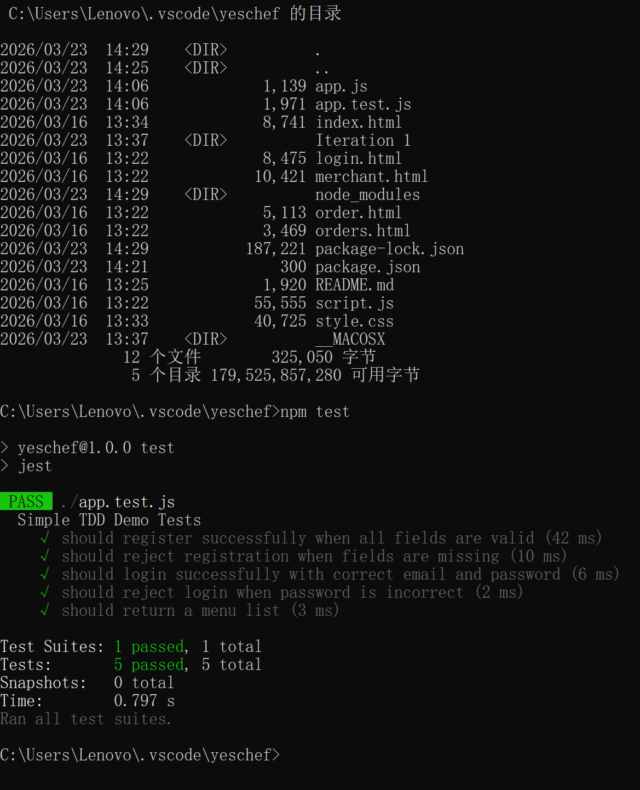

# YesChef – TDD Demonstration Report

## 1. Introduction

This report explains a small-scale Test-Driven Development (TDD) demonstration prepared for the YesChef project.

At the current stage, YesChef is still mainly a frontend prototype. The project includes interface pages such as the homepage, login page, order page, orders page, and merchant page. However, no real backend server has been officially integrated into the system yet, and the full backend development has not started.

Because of this, the purpose of this task was not to build the actual backend of the project. Instead, a separate and very small testing demo was created to demonstrate how the TDD approach from Chapter 8 could be applied to the future backend development of YesChef.

This demo was only used as a simple testing example. It was not integrated into the main frontend project, and it should not be treated as the final backend implementation of the system.

---

## 2. Purpose of the TDD Demo

The purpose of this TDD demo was to:

- show how user stories can be translated into test specifications;
- demonstrate a very small-scale testing process using simple example code;
- explain how backend behaviour could be tested before full backend development begins;
- connect the ideas of TDD, Strategy Pattern, and Mock Object concepts to the future design of the YesChef project.

This means the demo was mainly for learning and demonstration, rather than for production use.

---

## 3. Current Project Status

The current YesChef project is still frontend-focused.

At this stage:

- the project mainly contains frontend pages and interface logic;
- no actual backend server has been connected to the frontend;
- no real database has been added;
- no complete backend architecture has been built;
- the tested code was created only as a separate demonstration file.

Therefore, the testing work completed in this task should be understood as a small independent practice example, not as an official backend module of the system.

---

## 4. Selected User Stories

Only three user stories were selected for this small demonstration.

### User Story 1 – Registration
As a new user, I want to register an account so that I can use the system.

### User Story 2 – Login
As a registered user, I want to log into the system so that I can access my account.

### User Story 3 – View Menu
As a user, I want to view menu items so that I can choose food easily.

These three user stories were chosen because they are simple, clear, and closely related to the existing frontend prototype.

---

## 5. Test Specifications

Each selected user story was converted into simple expected behaviours.

### For User Story 1 – Registration
- should register successfully when all fields are valid
- should reject registration when fields are missing

### For User Story 2 – Login
- should login successfully with correct email and password
- should reject login when password is incorrect

### For User Story 3 – View Menu
- should return a menu list

In total, five test cases were used in the demonstration.

---

## 6. How TDD Was Demonstrated

This task followed the general TDD idea introduced in Chapter 8, but only at a demonstration level.

### Step 1 – Start from user stories
The first step was to choose a small number of user stories from the YesChef frontend prototype.

### Step 2 – Convert user stories into test cases
Each selected story was rewritten as one or more test specifications describing expected behaviour.

### Step 3 – Write simple test code
A small test file was created to check whether the example logic behaved as expected.

### Step 4 – Run the tests successfully
The tests were executed and all five test cases passed successfully.

This small exercise demonstrates the basic principle of TDD:
requirements can be expressed as tests first, and implementation logic can then be developed to satisfy those tests.

However, this should be understood only as a learning demonstration, not as a complete backend development process.

---

## 7. Scope of the Demo

The scope of this work was intentionally very limited.

It only included:

- one simple example application file (`app.js`);
- one simple automated test file (`app.test.js`);
- fake in-memory data for testing purposes only.

This means:

- no real server deployment was completed;
- no frontend-backend integration was completed;
- no database connection was created;
- no formal backend structure was established.

The demo only showed how a few core behaviours could be tested in isolation.

---

## 8. Screenshot Placement

### Insert Screenshot 1 Here
**Suggested screenshot:** Terminal / command prompt output showing all 5 tests passed successfully.

**Suggested caption:**  
Figure 1. Test results for the standalone TDD demonstration showing that all five example test cases passed successfully.

---

## 9. Strategy Pattern Discussion

Although the Strategy Pattern was not fully implemented in this demo, it is still relevant to the future development of YesChef.

For example, the recommendation feature in the future system could apply different recommendation strategies, such as:

- keyword-based recommendation;
- price-based recommendation;
- user-preference-based recommendation.

Using the Strategy Pattern would allow different recommendation methods to be separated and switched more easily. This would improve maintainability and flexibility when the actual backend is developed later.

Therefore, in this report, the Strategy Pattern is discussed as a future design idea rather than something already implemented in the current project.

---

## 10. Mock Object / Fake Data Discussion

The demo also relates to the idea of mock-based testing.

In this task, no real database or external backend service was connected. Instead, simple fake in-memory data was used only to support the test demonstration.

This is similar to the purpose of mock objects:

- reducing dependency on external systems;
- keeping tests simple and fast;
- allowing behaviour to be tested independently;
- making early-stage testing easier before real backend development begins.

Therefore, the fake data used here should be understood as a simple demonstration of mock-style thinking, not as a final system design.

---

## 11. Test Result Summary

The final test run showed:

- 1 test suite passed
- 5 tests passed
- 0 tests failed

This result shows that the small demonstration code behaved as expected for the selected examples.

It does **not** mean that the full YesChef backend has been completed. Instead, it means that a small TDD-style testing exercise was successfully carried out.

---

## 12. Conclusion

This report presented a small standalone TDD demonstration for the YesChef project.

Since the YesChef system is currently still a frontend prototype, no real backend server, database, or full backend architecture has been officially integrated yet. For this reason, the work completed in this task was limited to a separate testing example rather than a full backend implementation.

Three user stories were selected: registration, login, and menu viewing. These stories were converted into five simple test cases, and the tests were executed successfully.

This demonstration shows how the ideas from Chapter 8 can support future backend development:
starting from user stories, defining expected behaviours through tests, and using testing to guide implementation.

Although the work was small in scope, it provides a clear example of how TDD thinking could be applied when the actual backend of YesChef is developed later.